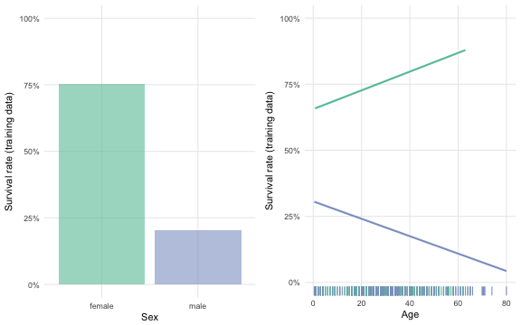
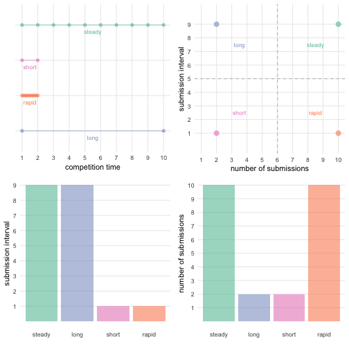

# Agenda

- Network structure and problem solving
- Derex and Boyd, 2015
- New experiment: Diachronic teams
- Kaggle competition data

# Small world networks

##

Watts & Strogatz (1998). Collective dynamics of "small-world" networks. _Nature_.

<aside class="notes">
This paper has been cited over 30,000 times. It describes the properties of small-world networks, but the reason it's been cited so many times is because it argued for network properties to exist independent of domain or substrate. Small-world networks are small-world networks whether they exist in people or neurons. On this view networks are mathy and pure, and they use math to demonstrate that real world networks have small-world properties.
</aside>

##


<aside class="notes">
Watts & Strogatz interpolated between regular and random graphs and probed the properties of networks along this dimension while holding the number of vertices and edges constant. Two properties of the resulting networks are compared: the average path length between any two nodes (L), and the clustering coefficient (C). These values are correlated in both regular and completely random networks but they diverge for the networks in the middle. For these networks, the average path length distance drops while the clustering coefficients remain largly constant. These networks are called small-world networks because they look regular locally but behave dynamically globally.
</aside>

##

- movie actors
- power stations
- roundworm brain
- **disease contagion (simulation)**


<aside class="notes">
The primary empirical results presented by Watts & Strogatz were that three real-world networks exhibit the parameters of small-world networks. The examples they investigated were networks of movie actors, power stations, and the neural network of a type of roundworm. They also present some simulation results of disease contagion, which basically show that although contagion is the fastest in fully random networks, it only takes a few random edges to drastically decrease the overall time for a disease to take over a population.
</aside>

##

> A recent paper (Watts & Strogatz, 1998) has shown that the connection topology of some biological and social networks is neither completely regular nor completely random.

<aside class="notes">
Here is an example of a pointed citation of Watts & Strogatz pointing out that what Watts & Strogatz really did was open a door more than answer a question. But, it's been cited 30,000 times, so obviously people don't have a problem arguing about it.
</aside>

# Networks as teams

##

- Lazer & Friedman (2007). The network structure of exploration and exploitation. _ASQ_.
- **Mason, Jones, & Goldstone (2008). Propagation of innovations in networked groups. _JEP: G_.**

<aside class="notes">
One of the reasons I think the Watts & Strogatz paper has been cited so many times is that it inspired others to think about what might be good about partial connectivity in networks, because it seems that most of the world's networks are partially connective in this way. So what are small-world networks better at? Here are two papers that argue that small world networks are better when there is the possibility of a fully connected network to get stuck in a local minima. The paper here is some modeling work but I'm going to talk about the second one, which dealt with humans working together in networked teams.
</aside>

##


##

<aside class="notes">
Participants played a simple guessing game where they entered a number between 1 and 100, and got some score, and they simply wanted to maximize their score. They could view the guesses and scores of other players, and who they saw was determined by their assignment to a network structure condition. They used a number of different landscapes in the paper but it's the unimodal/multimodal landscapes I'm interested in. For both landscapes there is a global maximum, but for the multimodal landscape there are these other, slightly shorter peaks, and you can imagine bouncing around, trying to find this peak and not necessarily knowing whether you were at the maximum or not. What's interesting about the multimodal landscape is that there are places you might get stuck.
</aside>


##

<aside class="notes">
They found that for the simpler, unimodal landscape, the fully connected network was best, but for the multimodal landscapes, small world networks tended to outperform the other network structures. What I think is the most important thing to take away from this paper is not that all small world networks are good, but that team structure matters for problem solving in teams. But this is one of the bits of evidence in favor of partial networks.
</aside>


# Potions

##

Derex & Boyd (2016). Partial connectivity increases cultural accumulation within groups. _PNAS_.

##


##


##


##


# When are efficient networks more efficient?

##

Mason & Watts (2012). Collaborative learning in networks. _PNAS_.

##


##


##


##


<aside class="notes">
There are two main differences between Mason, Jones, & Goldstone (2008) [number guessing] and Mason & Watts (2012) [oil drilling]. First, there was more ambiguity around the global maximum, meaning people were more likely to get trapped. Second, there was a visual indicator of past guesses for the Wildcat Wells experiment but presumably people had to remember their guesses in the number guessing experiment.
</aside>

# Totems

##

Derex & Boyd (2015). The foundations of the human cultural nichce. _Nat Comm_.

##


##


##


##


# Landscape

##


##


##


# What's still unknown?

- Compare individual and social controlling for **cost** of labor.
- How is one's own ability changed by the progress made by others?

# Diachronic teams

##


<aside class="notes">
The primary hypothesis I want to test is the conditions under which diachronic collaboration is a more efficient use of labor hours than synchronic collaboration. By far the most typical form of teamwork is synchronic collaboration. Across all of the studies I've shown so far, all of the networks tested were synchronic networks. Everyone saw what everyone else was doing at the time they were doing it. But diachronic collaboration is actually very pervasive in human history, especially in the history of human invention. Although we tend to uphold individual inventors as being geniuses way ahead of their time, history tends to show otherwise, and inventors are always building off of each other's inventions far more often then they are blazing their own path.

It seems a little weird to call generations of inventors as members of the same team. A more common way to describe the help individuals get from past generations is as cultural accumulation. Humans are pretty good at accumulating cultural junk, and one of the benefits of the fact that everything can be saved is that you never have to start from scratch on a problem.

So here's the question: what really is the benefit of starting off with where someone else left off. Does inheriting someone else's solution to a problem just give you a head start in solving the problem, or does it actually make you a better problem solver?
</aside>

##

Does inheriting someone else's solution to a problem just give you a head start or does it actually make you a more effective problem solver?

##


##


##


##


# Kaggle competitions

## 


```
## Error in connect_kaggle(): kaggle.sqlite not found
```

```
## Error in eval(expr, envir, enclos): object 'kaggle_db' not found
```

```
## Error in eval(expr, envir, enclos): object 'kaggle_db' not found
```

```
## Error in eval(expr, envir, enclos): object 'leaderboards' not found
```

```
## Error in eval(expr, envir, enclos): object 'top_100' not found
```

```
## Error in eval(expr, envir, enclos): object 'top_100' not found
```

```
## Error in eval(expr, envir, enclos): object 'top_100' not found
```

```
## Error in eval(expr, envir, enclos): object 'top_100' not found
```


<aside class="notes">
Kaggle competitions are data-oriented challenges in which teams and individuals use statistics and machine learning to make accurate predictions about unlabeled data. For example, a standard Kaggle competition is to predict the survivors of the Titanic. Given a passenger's ticket information, how accurately can teams predict whether or not the passenger survived? This example is a bit more morbid than usual, but otherwise it's illustrative of the fact that perfect performance is rarely possible in a Kaggle competition. It's likely impossible to predict exactly who survived the Titanic based only on ticket information, but people can do far better than chance. The way teams improve their predictions is by using statistics and machine learning to generate more and more accurate predictions. Teams can use any method in statistics and machine learning to generate the predictions, which means there are many possible solutions to any Kaggle competition. The goal of this report is to determine whether iteration and team size are successful strategies to approaching Kaggle competitions regardless of what specific method is being used.
</aside>



##


```
## Error in ggplot(top_100_places, aes(Place, TotalSubmissions)): object 'top_100_places' not found
```

```
## Error in eval(expr, envir, enclos): object 'gg_submissions_per_place' not found
```

##


```
## Error in ggplot(top_100_places, aes(Place, SubmissionsToFirstPlace)): object 'top_100_places' not found
```

```
## Error in eval(expr, envir, enclos): object 'gg_relative_submissions_per_place' not found
```

##


```
## Error: 'data' not found, and some variables missing from formula environment
```


```
## Error in ggplot(top_100_by_submission_bin, aes(TotalSubmissionsBin, Place)): object 'top_100_by_submission_bin' not found
```

```
## Error in predict_fn(mod, ., se = TRUE): object 'place_mod' not found
```

```
## Error in is.data.frame(data): object 'top_100' not found
```

```
## Error in predict_fn(mod, ., se = TRUE): object 'place_mod_lm' not found
```

```
## Error in eval(expr, envir, enclos): object 'gg_place_from_submissions' not found
```

##


```
## Error in eval(expr, envir, enclos): object 'leaderboards' not found
```

```
## Error in ggplot(submissions_sample, aes(SubmissionNum, PredictedPlace)): object 'submissions_sample' not found
```

```
## Error: 'data' not found, and some variables missing from formula environment
```

```
## Error in predictSE(team_submissions_mod, newdata = .): object 'team_submissions_mod' not found
```

```
## Error in eval(expr, envir, enclos): object 'gg_predicted_place_from_submissions' not found
```

# Submission interval

##


```
## Error in ggplot(top_100_places, aes(Place, TotalTime)): object 'top_100_places' not found
```

```
## Error in eval(expr, envir, enclos): object 'gg_submission_interval_per_place' not found
```

##


```
## Error in ggplot(top_100_places, aes(Place, PropCompetitionTime)): object 'top_100_places' not found
```

```
## Error in eval(expr, envir, enclos): object 'gg_prop_time_per_place' not found
```

# Team types

##



##


```
## Error in ggplot(top_100, aes(TotalSubmissions, TotalTimeSec)): object 'top_100' not found
```

```
## Error in eval(expr, envir, enclos): object 'gg_team_types_density' not found
```

```
## Error in eval(expr, envir, enclos): object 'gg_team_types_density' not found
```

##


```
## Error in ggplot(top_100): object 'top_100' not found
```

```
## Error in eval(expr, envir, enclos): object 'gg_quadrant_sizes' not found
```

##


```
## Error in eval(expr, envir, enclos): object 'top_100' not found
```

```
## Error in ggplot(top_100, aes(TeamNum, Place)): object 'top_100' not found
```

```
## Error in is.data.frame(data): object 'top_100' not found
```

```
## Error in predict(team_types_lm_mod, newdata = ., se = TRUE): object 'team_types_lm_mod' not found
```

```
## Error in eval(expr, envir, enclos): object 'gg_team_types' not found
```

```
## Error in eval(expr, envir, enclos): object 'gg_team_types_place' not found
```

# End!

<!-- extra slides -->

# Individual versus social

##

Derex, Feron, Godelle, & Raymond (2015). Social learning and the replication process: an experimental investigation. _Proc. R. Soc. B_.

##


##


##


##


